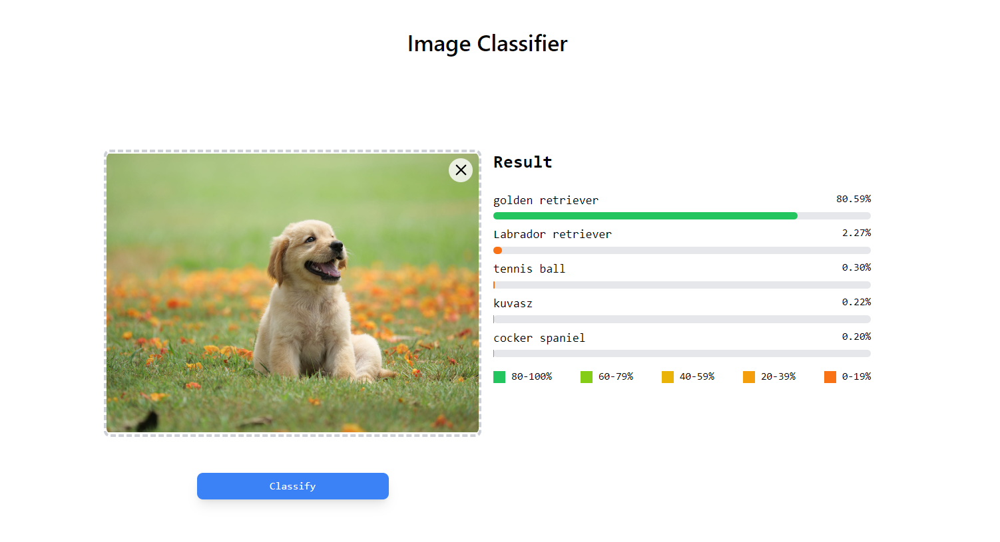

<h1 align="center">Image Classifier</h1>

---



---
<p align="center">
  <a href="#introduction">Introduction</a> •
  <a href="#prerequisites">Prerequisites</a> •
  <a href="#getting-started">Getting Started</a> •
  <a href="#running-tests">Running Tests</a> •
  <a href="#shutting-down">Shutting Down</a> •
  <a href="#debugging">Debugging</a>
</p>

---

## Introduction

_Image Classifier_ is an efficient full-stack image classification application built with a Django backend, a NextJS and TailwindCSS frontend, and machine learning capabilities powered by Pytorch Image Models (timm). It utilizes Docker Compose for containerization, a PostgreSQL database for data persistence and result caching, and Celery with Redis for efficient ML task management. This repository provides everything you need to set up and run the application.

---

## Prerequisites

- Docker
- Docker Compose

These can be installed by following the instructions at the following links:

- Docker: [https://docs.docker.com/get-docker/](https://docs.docker.com/get-docker/)
- Docker Compose: [https://docs.docker.com/compose/install/](https://docs.docker.com/compose/install/)

---

## Getting Started

1. Clone the repository:

    ```bash
    git clone https://github.com/musfiqus/web_image_classification.git
    cd web_image_classification
    ```

2. Build and start the Docker containers:

    ```bash
    docker compose up --build -d
    ```

    This command will start all the services defined in the `docker-compose.yml` file in detached mode. You should now be able to access the application:

   - Django application: [http://localhost:8000](http://localhost:8000)
   - NextJS application: [http://localhost:3000](http://localhost:3000)

3. Available Docker Compose services:
   1. `django`: This service handles the Django backend of the application.
   2. `react`: This service takes care of the frontend, which is built using NextJS and TailwindCSS.
   3. `postgres`: This service manages the PostgreSQL database used for data persistence.
   4. `celery`: This service is responsible for task queuing using Celery.
   5. `redis`: This service is used for in-memory data storage and task management.
---

## Running Tests

We use Django's built-in testing framework for testing the application.

To run tests, use the following command:

```bash
docker compose exec django python manage.py test
```

---

## Shutting Down

To stop running the application and remove the Docker containers, use the following command:

```bash
docker compose down
```

This command will stop all running services defined in the `docker-compose.yml` file and remove the containers.

---

## Debugging

In case you face any issues, you can check the logs of a service using the following command:

```bash
docker logs <service_name>
```

---

